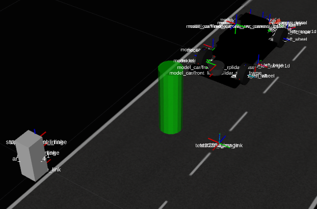
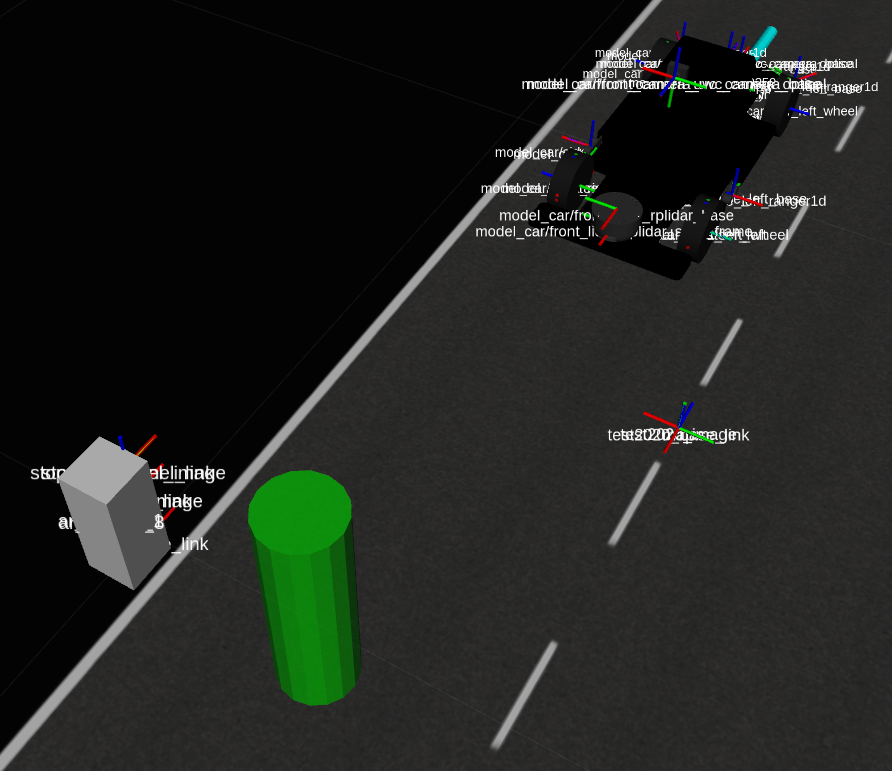

# Exercises
The objective of these exercises it to complete the iri_traffic_sign_cnn_main ROS node implementation to modify the behavior of the car depending on the traffic signs on the road. This ROS node already provides the necessary topics and services and other ROS tools to more easily complete the proposed tasks.

In particular, the car should be able to execute the following actions:

* When a stop sign is present, the car should continue moving until its frontal part reaches the stop sign position.

* When a Turn left/right sign is present, the car should turn 90 degrees towards the direction given by the traffic sign, once the car has completely overtaken the traffic sign. When the car has turn 90 degrees, it should continue straight.

* When a speed limit sign is present, the car should change the forward speed according to the value in the traffic sign. In this case, the change in speed should happen when the car overtakes the traffic sign, not before.

All traffic signs will have the same AR tag (*alvar1* with ID=1) in order to simplify the process of finding their position on the image. If other traffic signs or other objects (with different AR tag) are present, the car should ignore them.

All image processing is performed using OpenCV and the main ROS node is designed to isolate the user from the conversion between ROS and OpenCV and vice versa. Additionally, some helper functions are provided to perform some basic operations that may be required for the workshop, however, the user may chose to implement them by themselves. These helper functions are listed and described in the next section.

## Helper functions
A function to get the current position and orientation of the car with respect to the *map* frame, using the ground truth odometry provided by the Gazebo simulator.
```
bool get_current_pose(geometry_msgs::PoseStamped &pose);
```
* **pose**: this parameter has the current pose of the car with respect to the *map* frame.

If the returned pose data structure is valid, this function will return true, and false otherwise. It may return false if no odometry information has been received from the last call.

A function to convert the PoseStamped data to a new reference frame using a TF listener.
```
bool transform_pose(geometry_msgs::PoseStamped &pose,std::string &frame_id,geometry_msgs::PoseStamped &new_pose);
```
* **pose**: is the original position to transform (the time and the reference frame must be embedded in the header of the data structure).
* **frame_id**: is the target reference frame to which the pose information has to be transformed.
* **new_pose**: this parameter has the original pose with respect to the *frame_id* frame.

If the pose have been successfully transformed, this function will return true, and false otherwise.

A function to publish an image. It is designed to publish the patch of the image where the traffic sign is supposed to be, but it can be used to publish other images. The only restriction is that the images must have the same encoding as the input image to be displayed properly:
```
void publish_detection_image(const cv::Mat &image);
```
* **image**: image to be published in OpenCV format. All the conversions to a ROS message if performed internally. 

A function to send the motion command to the simulated car:
```
void send_car_control(double speed,double steer_angle);
```
* **speed**: desired longitudinal speed of the car in meters per second.
* **steer_angle**: desired steering angle of the car in radians.

A function to get the closest marker. This option may not always be the best choice, but for the simple set up used in this workshop, it is more than enough. 
```
bool get_closest_marker(ar_track_alvar_msgs::AlvarMarker &closest_marker);
```
* **closest_marker**: object with the information of the closest marker to the car.

If no marker data is available, this function will return false, and true otherwise.

A function to send the image to the ROS node implementing the CNN and get the predicted class and probability.
```
bool classify_image(const cv::Mat &image,std::string &class_name, double &prob);
```
* **image**: patch of the input image where the traffic sign is supposed to be.
* **class_name**: name of the class to which the traffic sign in the image patch belongs.
* **prob**: probability that the traffic sign belongs to the *class_name* class.

If the CNN succeeds in classifying the image patch, this function will return true, and false otherwise.

A function to publish a pose as a visual marker on the RVIZ application. It will be shown as a green cylinder. This function may be modified to display more information required by the user.
```
void publish_visual_marker(const geometry_msgs::PoseStamped &marker_pose);
```
* **marker_pose**: is the position (referenced to the *map* frame) where the marker will be placed.

## Basic operation
The iri_traffic_sign_cnn_main ROS node already implements some of the required actions in the MainNodeThread function in the *iri_traffic_sign_cnn_main_alg_node.cpp* file, which is called periodically (the calling rate of this function can be changed in the *config/params.yaml* file or using the [rqt_reconfigure](http://wiki.ros.org/rqt_reconfigure) application).

The sequence of actions executed in this function are:

* Wait for new markers.
* Get the closest one.
* Get the image patch where the traffic sign is supposed to be. This function is empty by default and has to be implemented by the user in the first exercise.
* Publishes the image patch returned by the user function.
* Tries to classify the traffic sign on the image patch.
* Computes the position, in the *map* frame, where the car should execute the action associated with the detected traffic sign. This function is empty by default and has to be implemented by the user in the second exercise.
* Shows the action position on the RVIZ application as a green cylinder.
* Generates the motion commands to be sent to the robot. This function is empty by default and has to be implemented by the user in the third exercise.

For these exercises, the launch files *launch/sim.launch* and *launch/test.launch will be used. In the sim.launch file, the default spawned traffic sign is a *stop* sign, but it can be changed using the *sign_type* argument. For example, for the turn right traffic sign, execute the following command:
```
roslaunch iri_traffic_sign_cnn_main sim.launch sign_type:=turn_right
```

The supported traffic signs are listed here [iri_sign_description/README.md#Launch](https://gitlab.iri.upc.edu/mobile_robotics/adc/adc_2021/iri_sign_description/-/blob/master/README.md#launch).

The *car_speed* parameter in the *config/params.yaml* file set the initial speed of the car. If you don't want the car moving to do some testing, set it to 0 and relaunch the simulation.

# Exercise 1: Show the traffic sign detections
As a first step towards controlling the car depending on the traffic signs on the road, find and extract the traffic sign from the input image and publish it to make sure the detection is correct before sending it to the CNN to be classified.

To modify the code, go to the source folder of the iri_traffic_sign_cnn_main package
```
roscd iri_traffic_sign_cnn_main/src
```

Implement the following function in the *iri_traffic_sign_cnn_main_alg_node.cpp* file:
```
bool get_detection_image(const cv::Mat &input_image,const ar_track_alvar_msgs::AlvarMarker &marker,cv::Mat &traffic_sign)
```
* **input_image**: is an OpenCV Mat object with the most recent image received.
* **marker**: is the closest marker information associated with the input image. See the [AlvarMarker message](http://docs.ros.org/melodic/api/ar_track_alvar_msgs/html/msg/AlvarMarker.html) documentation for more information.
* **traffic_sign**: is the image patch with the traffic sign. This is an output parameter that has to be initialized by the user.

This function should return true if the *traffic_sign* image is valid, and false otherwise.

The parameters of the AR tag size, traffic sign size and the offset between them (all in meters) are defined in the config/params.yaml file, and can be accessed in code through:

* this->config_.artag_id
* this->config_.artag_size
* this->config_.sign_offset

The camera parameters are taken from the camera info topic and can be accessed in code through:

* this->focal_length_x
* this->focal_length_y
* this->center_x
* this->center_y
* this->image_width
* this->image_height

Once the code modifications are done, save them and execute the following commands to compile the ROS node:
```
roscd
cd ..
catkin_make
```

If the build process returns some errors, fix them. If the build process finishes successfully, test the results with the following command:
```bash
roslaunch iri_traffic_sign_cnn_main sim.launch
roslaunch iri_traffic_sign_cnn_main test.launch
```

The default RVIZ configuration already shows the image patch in the lower left side of the image. If the traffic sign is shown more or less centered while the car is moving, you may proceed to the next exercise. Also, check the terminal window for information messages such as this one:
```
Sc20CnnMainAlgNode:: Response: Stop with probability: 0.999981
```
which shows the prediction made by the CNN and its probability. Otherwise, improve your approach. You can take a look at the following hints:

### Hints
* The position and orientation of the markers is given with respect to the camera optical frame. If needed, take a closer look at the frames shown in the RVIZ application.
* Take a look at this [link](https://answers.opencv.org/answers/171005/revisions/) if you don't know how to project a 3D point to the image coordinates on the image plane.
* To get the image patch from the input image, you may use the [cv::Rect object](https://stackoverflow.com/questions/8267191/how-to-crop-a-cvmat-in-opencv) to define the region of the *input_image* to crop.

## Exercise 2: Compute the action position
If you could not complete the previous exercise, execute the following commands to get a simple implementation. Before executing these commands, take into account that all changes to the code will be discarded, so save them somewhere if you want to keep them.
```
roscd iri_traffic_sign_cnn_main
git checkout -f exercise1_solution
```
Check the code and take a look at the proposed simple solution. Feel free to modify and improve it.

In this exercise, use the position information of the traffic sign and its type to compute the global position (with respect to the *map* frame) where the car should execute the action associated with the traffic sign detected. For the set of traffic signs used in this workshop, there are mainly two cases:

* A position such that the frontal part of the car coincides with the traffic sign position. This is the case for the stop signal, and it is the simplest one because the traffic sign should always be visible. See the next picture for an example.



* A position such that the rear part of the car coincides or has overtaken the traffic sign position. This is the case for the turn left/right and the speed limit signals, and it is more complicated because the traffic sign will not be visible for quite some time, and the last valid position should be used. See the next picture for an example.



The name of the classes returned by the CNN are listed in [here](https://gitlab.iri.upc.edu/mobile_robotics/summer_school/cnn_workshop/iri_traffic_sign_classifier/-/blob/master/cnn/signnames.csv).

To modify the code, go to the source folder of the iri_traffic_sign_cnn_main package
```
roscd iri_traffic_sign_cnn_main/src
```

Implement the following function in the *iri_traffic_sign_cnn_main_alg_node.cpp* file:
```
bool compute_action_position(const geometry_msgs::PoseStamped &marker_pose,const std::string &class_name,geometry_msgs::PoseStamped &action_pose)
```
* **marker_pose**: is the position and orientation of the closest marker with respect to the front camera optical frame.
* **class_name**: is the name of the class of the detected traffic sign. It can be used to know which action position should be computed.
* **action_pose**: is the computed pose where the car should execute the required action. This is an output parameter that has to be computed by the user. 

This function should return true if the *action_pose* has been successfully computed, and false otherwise.

Once the code modifications are done, save them and execute the following commands to compile the ROS node:
```
roscd
cd ..
catkin_make
```

If the build process returns some errors, fix them. If the build process finishes successfully, test the results with the following command:
```
roslaunch iri_traffic_sign_cnn_main sim.launch sign_type:=<chosen_sign_type>
roslaunch iri_traffic_sign_cnn_main test.launch
```

The position computed should appear as a green cylinder in the RVIZ application. If the green cylinder appear where it is supposed to be in the two cases, you can proceed to the third exercise. Otherwise, improve your approach. You can take a look at the following hints:

### Hints
* Use the TF tool through the *transform_pose* function to transform the marker pose to the desired frame.
* You can first transform the marker pose to the *base_link* frame to take into account the transformation between the car and the camera frames.
* Use the relative position between the car and the marker to get the relative action position.
* Finally transform the action position to the *map* frame.

## Exercise 3: Compute the motion commands
If you could not complete the previous exercise, execute the following commands to get a simple implementation. Before executing the these command, take into account that all changes to the code will be discarded, so save them somewhere if you want to keep them.
```
roscd iri_traffic_sign_cnn_main
git checkout -f exercise2_solution
```
Check the code and take a look at the proposed simple solution. Feel free to modify and improve it.

In this exercise, use the type of the traffic sign detected and its probability (in order to ignore poor detections), together with the previously computed *action_pose* to compute the speed and steer_angle motion commands for the car, and when it is time to execute the action.

To modify the code, go to the source folder of the iri_traffic_sign_cnn_main package
```
roscd iri_traffic_sign_cnn_main/src
```

Implement the following function in the *iri_traffic_sign_cnn_main_alg_node.cpp* file:
```
void generate_car_control(const std::string &class_name,const double class_prob,const geometry_msgs::PoseStamped &action_pose,double &speed,double &steer_angle)
```
* **class_name**: is the name of the class of the detected traffic sign. 
* **class_prob**: is the probability of the detected class. This value ranges from 0.0 to 1.0, and a low value indicate a poor detection and it should be ignored.
* **action_pose**: is the the pose where the car should execute the required action. This pose is the one computed in the previous exercise.
* **speed**: this is the desired forward speed for the car in meters per second. This is an output parameter that has to be computed by the user. 
* **steer_angle**: this is the angle to turn the front wheels in radians. This is an output parameter that has to be computed by the user. 

It is recommended to start with the stop and turn traffic signs, and consider the speed limit case the last. 

Once the code modifications are done, save them and execute the following commands to compile the ROS node:
```
roscd
cd ..
catkin_make
```

If the build process returns some errors, fix them. If the build process finishes successfully, test the results with the following command:
```
roslaunch iri_traffic_sign_cnn_main sim.launch sign_type:=<chosen sign type>
roslaunch iri_traffic_sign_cnn_main test.launch
```

You should see the car executing the action required by the traffic sign at the appropriate position. If so, congratulations, you have successfully completed the CNN workshop. We hope you have enjoyed it. If not, improve your approach. You can take a look at the following hints:

### Hints
* The speed limit traffic signs range from 20 km/h to 120 km/h, and the valid speed values of the car are between 0 m/s and 0.5 m/s. As a first approach you may use a simple linear interpolation to compute the forward speed of the model car.

If you could not complete this exercise, execute the following commands to get a simple implementation. Before executing the these command, take into account that all changes to the code will be discarded, so save them somewhere if you want to keep them.
```
roscd iri_traffic_sign_cnn_main
git checkout -f exercise3_solution
```
Check the code and take a look at the proposed simple solution. Feel free to modify and improve it.
