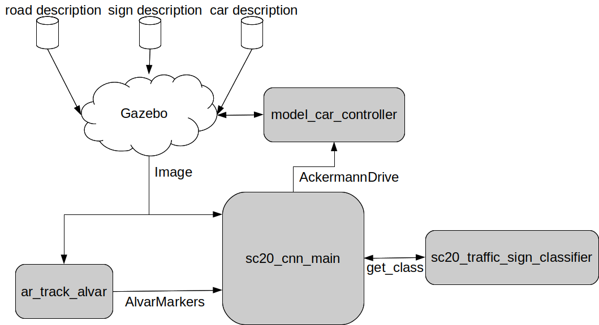

# ROS and CNN
Now that you are familiar with both the simulation environment and the CNN used to classify traffic signs, here we describe the ROS nodes used in the workshop and the connection between them, which is shown in the next figure:



## Gazebo and model_car_controller
The gazebo simulator generates the output of all the sensors available on the car from the simulated world (in this case the road and signs descriptions), including the front camera images used in this workshop.

The *model_car_controller* plug-in interfaces with the Gazebo simulator to control the robot model and provides a topic of the *ackermann_msgs/AckermannDrive.msg* type to the user. See the [model_car_controller](https://gitlab.iri.upc.edu/mobile_robotics/adc/platforms/model_car/simulator/iri_model_car_controller) documentation for more information.

## ar_track_alvar
This ROS node detects all the possible Alvar AR tags on the input image and also estimates their position and orientation with respect to a given frame. It takes an image as an input and, together with the AR tag size information, it publishes the pose of all detected tags. See the [ROS node](http://wiki.ros.org/ar_track_alvar) documentation for more information.

With the default workshop configuration, the pose is given with respect to the camera frame.

## iri_traffic_sign_classifier
This ROS node uses the trained CNN model to classify the input image in one of the possible classes. This node has a service of the *iri_traffic_sign_cnn_workshop_msgs/get_class.srv* type that accepts a patch of the original image and returns the index of the class it most probably belongs to. See the [iri_traffic_sign_classifier](https://gitlab.iri.upc.edu/mobile_robotics/summer_school/cnn_workshop/iri_traffic_sign_classifier) documentation for more information.

The input image patch can be of any size, the ROS node will scale it and perform all the required pre-processing before passing it to the CNN. 

## iri_traffic_sign_cnn_main
This ROS node implements the logic of the system. By default it only moves the model car forward, but it already has all the ROS topics ans services integrated into it and it is a good starting point for the exercises. See the [iri_traffic_sign_cnn_main](https://gitlab.iri.upc.edu/mobile_robotics/summer_school/cnn_workshop/iri_traffic_sign_cnn_main) documentation for more information.

# Launch the whole system
If it is the first time running gazebo, execute the following command before launching the nodes:
```
gzserver
```
and wait for a while until all models have been downloaded.

To run the simulation nodes (Gazebo, spawn car, spawn road, spawn traffic sign), execute the following command:

```bash
roslaunch iri_traffic_sign_cnn_main sim.launch
```

Then, to run the detection and CNN nodes, execute:

```bash
roslaunch iri_traffic_sign_cnn_main test.launch
```

For now, only the AR tag detection will be shown (as a TF frame and a visualization_marker).

Continue with the next section [Exercises](./exercises.md) to complete the solution. 
