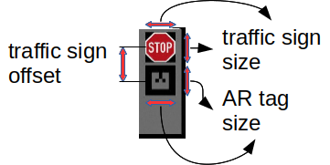

# Simulated environment

The robot used for this workshop is a 1:8 scale model car. All the information about the car itself and its simulated model can be found here [iri_model_car_how_to](https://gitlab.iri.upc.edu/mobile_robotics/adc/platforms/model_car/iri_model_car_how_to).

Follow the next tutorials to learn about how to use the simulated car:
- [Simulated model car](https://gitlab.iri.upc.edu/mobile_robotics/adc/platforms/model_car/iri_model_car_how_to/-/blob/master/doc/simulated_model_car.md)
- [General operation](https://gitlab.iri.upc.edu/mobile_robotics/adc/platforms/model_car/iri_model_car_how_to/-/blob/master/doc/operation.md)
- [Teleoperation](https://gitlab.iri.upc.edu/mobile_robotics/adc/platforms/model_car/iri_model_car_how_to/-/blob/master/doc/teleoperation.md)

# Traffic signs
If the simulator is not already running, start it with the following command:
```
roslaunch iri_model_car_gazebo sim.launch
```

To simplify the detection of the position of the traffic signs in the whole image, each traffic sign has the structure shown in the next Figure:



Execute the following command to spawn a stop traffic sign in Gazebo:
```
roslaunch iri_sign_description spawn_sign.launch name:=sign1 tag:=alvar1 type:=stop x:=0.75 y:=-0.5
```

An AR tag (**alvar1**) is placed below the traffic sign symbol which can be easily detected using a number of tools already available. In our case we use the [ar_track_alvar](http://wiki.ros.org/ar_track_alvar) ROS node, which, in addition to detect all the AR tags on the image, it also estimates their position and orientation (given the actual size of the AR tag).

The most important dimensions of the traffic signs are shown in the next table:

| parameter           |      Value     |
|---------------------|----------------|
| AR tag size         |   0.05 m       |
| Traffic sign size   |   0.05 m       |
| Traffic sign offset |   0.065 m      |

With the AR tag detection is easy to get the patch of the image where the traffic sign is supposed to be.

You can view the camera image with:
```bash
rosrun rqt_image_view rqt_image_view /model_car/sensors/basler_camera/image_raw
```

You can teleoperate the model car with:
```bash
roslaunch iri_model_car_launch teleop_rqt.launch
```
