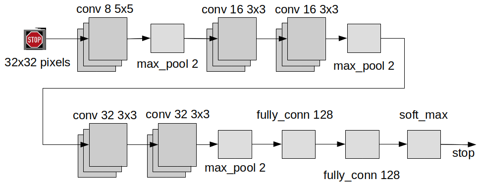
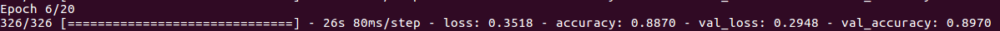
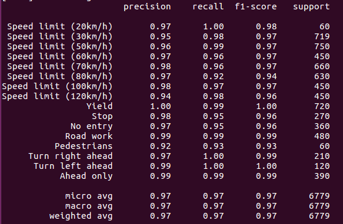

# Traffic sign classifier CNN
The CNN used to classify traffic signs is based on the one used in this online [tutorial](https://www.pyimagesearch.com/2019/11/04/traffic-sign-classification-with-keras-and-deep-learning/) with a few modifications:

* OpenCV functions are used to handle the input images instead of the SciKit ones.
* The number of classes has been reduced to speed up the learning process. The supported classes are:
    * Speed limit (20km/h)
    * Speed limit (30km/h)
    * Speed limit (50km/h)
    * Speed limit (60km/h)
    * Speed limit (70km/h)
    * Speed limit (80km/h)
    * Speed limit (100km/h)
    * Speed limit (120km/h)
    * Yield
    * Stop
    * No entry
    * Road work
    * Pedestrians
    * Turn right ahead
    * Turn left ahead
    * Ahead only
* The basic hyper-parameters can be passed as arguments to control the training of the CNN more easily.

If you are new to Convolutional Neural Networks (CNN), check the following links to get a minimum understanding of what they are and how they work:

* [Introduction to Convolutional Neural Networks](https://web.stanford.edu/class/cs231a/lectures/intro_cnn.pdf)
* Overall read of chapters 5 and 9 of the [Deep Learning Book](http://faculty.neu.edu.cn/yury/AAI/Textbook/DeepLearningBook.pdf)

## Get the CNN
The CNN definition and the scripts to train and test it have been included as part of this ROS node [iri_traffic_sign_classifier](https://gitlab.iri.upc.edu/mobile_robotics/summer_school/cnn_workshop/iri_traffic_sign_classifier) that classifies the traffic signs.

The architecture of the CNN used is shown in the next Figure.



The input to the CNN is a 32x32 pixel image, and the output is a vector with the probability for each of the possibles classes (16 in this case). The predicted class is the one with the highest probability.

## Train the CNN
Both the train and the predict scripts performs the following actions on each image of the train and test sets to improve the performance of the CNN:

* Changes the size to 32x32 pixels.
* Applies a histogram equalization algorithm to improve the contrast.
* Scales the pixel data to the range from 0 to 1.

Before training, the train script also increases the number of samples of the classes of the train set that are not well represented (small number of samples compared to other classes). To do this, it takes the existing images and create new ones from them applying geometric transformations.

To train the net, the [Categorical Crossentropy](https://www.tensorflow.org/api_docs/python/tf/keras/losses/CategoricalCrossentropy) loss function and the [Adam](https://www.tensorflow.org/api_docs/python/tf/keras/optimizers/Adam) optimizer are used.

For a more detailed description of the train script, check the [original tutorial](https://www.pyimagesearch.com/2019/11/04/traffic-sign-classification-with-keras-and-deep-learning/).

To train the neural network with the reduced data set provided for this workshop, follow the next steps:

* Activate the Python virtual environment, already created in the setup.

```
source ~/summer_school/traffic_sign_venv/bin/activate
```
* Go to the ROS package that has the CNN implementation:
```
roscd iri_traffic_sign_classifier/cnn
```
* Execute the train script with the following command:
```
python train.py --dataset ~/summer_school/traffic_sign_data_set/ --model ../model/trafficsignnet.model --plot ../model/plot.png --epochs 20 --rate 0.001 --batch 64
```

Here is a brief description of the parameters passed to the training script:

* **dataset**: the location of the training and test image sets. This parameter must point to the location where the reduced data set was downloaded.
* **model**: the location where the trained model will be placed. In this case the path is the one used by the ROS node at run time so that nothing has to be modified once the net has been trained. If this path is changed, the launch files must also be modified.
* **plot**: the location where the plot showing the progress of the training will be saved. This path can be changed without any problem.
* **epochs**: the number of epochs used for training. This is the number of times the whole training data is shown to the network while training.
* **rate**: the learning rate of the net. This defines how quickly a network updates its parameters.
* **batch**: the size of the batch. This is the number of samples given to the network after which parameter update happens.

Depending on the computer, the training of the CNN may take a while. While training, the script will show the progress of each epoch on screen.



If you are new to CNN, here is a brief description of the parameters shown:

* **loss**: this is the total difference between the predicted value by CNN and the true value for all the images in the training set.
* **accuracy**: this measure the performance of the CNN as a ratio between the number of correct predictions and the total number of samples for the training set.
* **val_loss**: this is the total difference between the predicted value by CNN and the true value for all the images in the validating set.
* **val_accuracy**: this measure the performance of the CNN as a ratio between the number of correct predictions and the total number of samples for the validation set.

At the end of the training process, the script shows the results of the training process for each of the classes, as shown in the next picture:



If you are new to CNN, here is a brief description of the parameters shown:

* **precision**: it measures the proportion of positive identifications that are actually correct. That is, a ratio of the samples that are classified as a given class even though they do not belong to it. If no false positives are detected, this ratio is 1.0.
* **recall**: it measures the proportion of actual positives that are identified correctly. That is, a ratio of the samples that are not classified as a given class even though they do belong to it. If no false negatives are detected, this ratio is 1.0.
* **f1-score**: this is a combination of the precision and recall values.

Also, the *../model/plot.png* will show the evolution of the loss,accuracy, val_loss and val_accuracy values for each epoch of the training process.

## Test the CNN
If you completed the training of the CNN, all the necessary information is stored in the *model* folder of the *iri_traffic_sign_classifier* ROS node. 

Otherwise, you can download an already trained model from this IRI google drive [link](https://drive.google.com/file/d/18vVnP992kBlgu5LCcHf2VUlKqgdy7m_z/view?usp=sharing).

To use the downloaded train mode, follow the next steps:

* Download the already trained model. It is recommended to place it in the *model* folder, but it can be placed anywhere. In that case, remember to change the path to the data set when launching the ROS node or testing the CNN with the prediction script.

* Create a `model` folder to extract the contents into:
```
roscd iri_traffic_sign_classifier
mkdir -p model
cd model
```

* Extract the contents.
    * If using docker, first copy the downloaded file to the shared folder (`~/summer_school/docker/shared`) and then inside the container do:

    ```
    roscd iri_traffic_sign_classifier/model
    cp ~/shared/trafficsignnet.model.tar.gz .
    tar -zxvf trafficsignnet.model.tar.gz
    ```

    * Or if working in local, copy it directly:

    ```
    roscd iri_traffic_sign_classifier/model
    cp ~/Downloads/trafficsignnet.model.tar.gz .
    tar -zxvf trafficsignnet.model.tar.gz
    ```

To test the correct operation of the CNN, execute the following command:
```
roscd iri_traffic_sign_classifier/cnn
python predict.py --model ../model/trafficsignnet.model --images ~/summer_school/traffic_sign_data_set/Test --examples examples --num 25
```

Here is a brief description of the parameters passed to the prediction script:

* **model**: the location where the trained model was placed in training.
* **images**: the location of the images used for testing. This parameter must point to the location where the reduced data set was downloaded.
* **examples**: the path were the subset of labeled images will be placed after testing. This path can be changed without any problem.
* **num**: the number of random images taken to test the operation of the trained net. This is the number of images that will be labeled and placed in the *examples* folder.

This scripts randomly takes *num* images from the test set and classifies them. The result can be seen in the *examples*, where each images has been labeled with its predicted class.

When the scripts ends, check that the images in the *examples* folder have the correct label.

```
eog examples/0.png
# right/left keyboard arrow keys to move through images
```


When finished, deactivate the virtual environment:

```
deactivate
```

